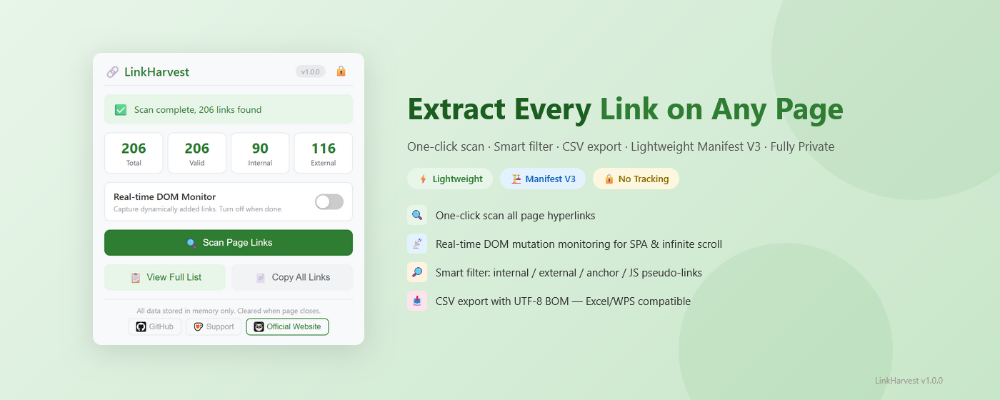

# LinkHarvest

[English](../README.md) | [中文](README_zh.md) | [Español](README_es.md) | [Deutsch](README_de.md) | [日本語](README_ja.md) | Français

Une extension légère du navigateur qui extrait tous les liens hypertextes de n'importe quelle page web, avec filtres intelligents et export CSV.

> Basé sur Chromium · Manifest V3 · Aucun suivi · Données locales uniquement

---

## Fonctionnalités

| Fonctionnalité | Description |
|----------------|-------------|
| 🔍 **Scan en un clic** | Extrait tous les liens `<a>` de la page actuelle |
| 📡 **Surveillance DOM temps réel** | MutationObserver capture les liens ajoutés dynamiquement (SPA, défilement infini) |
| 🔎 **Filtre intelligent** | Filtre les liens d'ancre et pseudo-liens JS ; distingue interne/externe |
| 📋 **Copie par lot** | Copie tous les liens valides dans le presse-papiers en un clic |
| 📥 **Export CSV** | Encodage UTF-8 BOM — compatible Excel/WPS |
| 🔒 **Données locales uniquement** | Toutes les données en mémoire du navigateur ; effacées à la fermeture |
| 🌍 **Multi-langues** | Anglais, Chinois, Japonais, Allemand, Espagnol, Français |
| ⚡ **Léger** | JavaScript pur, aucune dépendance, paquet < 40 Ko |
| 🏗️ **Manifest V3** | `activeTab` + `scripting` uniquement — permissions minimales |

---

## Aperçu

  

---

## Navigateurs compatibles

| Navigateur | Statut |
|-----------|--------|
| Google Chrome | ✅ Entièrement compatible |
| Microsoft Edge | ✅ Entièrement compatible |
| Autres navigateurs Chromium | ✅ Devrait fonctionner |

---

## Installation

1. Ouvrez la page des extensions de votre navigateur :
   - **Chrome** : `chrome://extensions/`
   - **Edge** : `edge://extensions/`
2. Activez le **Mode développeur** (interrupteur en haut à droite)
3. Cliquez sur **Charger l'extension non emballée** et sélectionnez le dossier du projet
4. Cliquez sur l'icône LinkHarvest dans la barre d'outils

---

## Utilisation

1. **Ouvrez la page web cible** et attendez le chargement du contenu dynamique
2. **Cliquez sur l'icône LinkHarvest** dans la barre d'outils
3. **Activez la surveillance DOM** (optionnel) — pour les pages avec défilement infini ou liens chargés différés
4. **Cliquez sur « Scanner les liens »** — tous les liens sont extraits instantanément
5. **Voir la liste complète** — ouvre une page de résultats dédiée avec vue tableau
6. **Rechercher et filtrer** — utilisez la barre de recherche et les filtres pour affiner les résultats
7. **Copier ou exporter** — copiez les liens dans le presse-papiers ou exportez en CSV

> **⚠️ Avis d'exportation CSV :** Les fichiers CSV exportés sont enregistrés sur le disque local de votre appareil. Ces fichiers sont gérés par vous ; l'extension ne contrôle pas leur cycle de vie. Veuillez supprimer manuellement les fichiers exportés lorsqu'ils ne sont plus nécessaires.

---

## Champs collectés

| Champ | Description |
|-------|-------------|
| `linkText` | Texte du lien (nettoyé) |
| `href` | URL absolue complète |
| `target` | `_blank` / `_self` |
| `category` | ancre / pseudo-lien JS / lien protocole / normal |
| `isInternal` | Si le lien est de même origine |

---

## Confidentialité

- Permissions `activeTab` + `scripting` uniquement — rien de plus
- `activeTab` : Accorde l'accès uniquement lorsque vous cliquez activement sur l'icône de l'extension
- `scripting` : Utilisé pour injecter le script de collecte de liens dans la page actuelle
- Pas de permission `<all_urls>` — n'accède pas aux pages sans votre action
- Aucune requête réseau externe — tout le traitement se fait localement
- Pas d'accès à l'historique de navigation, pas de suivi utilisateur, pas de téléchargement de données
- Toutes les données de scan sont stockées uniquement en mémoire du navigateur et effacées à la fermeture
- [Privacy Policy](../privacy-policy.html)

### Autorisations NON demandées

| Autorisation | Raison de la non-demande |
|--------------|--------------------------|
| `<all_urls>` | N'accède pas aux pages sans action de l'utilisateur |
| `storage` (persistant) | Ne sauvegarde pas de données dans le stockage local persistant |
| `notifications` | N'envoie pas de notifications système |
| `cookies` | Ne lit pas et ne modifie pas les cookies |
| `webRequest` | N'intercepte pas et ne surveille pas les requêtes réseau |

### Données NON collectées

- ❌ Mots de passe, contenu des formulaires
- ❌ Données de cookies, LocalStorage, IndexedDB, SessionStorage
- ❌ Cache du navigateur, historique de navigation
- ❌ Identifiants utilisateur, informations de connexion
- ❌ Texte du corps de la page, images, vidéos ou autres contenus multimédias
- ❌ Données de scripts tiers, informations de suivi publicitaire
- ❌ Identifiants d'appareil, adresses IP, données de comportement utilisateur

### Droits des utilisateurs (RGPD/CCPA)

- **Droit d'arrêt :** Vous pouvez fermer l'extension ou arrêter l'analyse à tout moment
- **Droit de suppression :** Toutes les données en mémoire sont automatiquement effacées lorsque vous fermez la page ou le navigateur ; vous pouvez également supprimer manuellement les fichiers CSV exportés localement
- **Droit d'accès :** Cette extension ne stocke aucune donnée personnelle identifiable
- **Droit à la portabilité des données :** La fonctionnalité d'export CSV prend en charge l'exportation des données
- **Droit de retrait :** Cette extension n'implique aucun suivi de données ni profilage

---

## Avis de droits d'auteur

Cette extension lit uniquement les éléments de liens hypertextes rendus publiquement (`<a>`) des pages web pour la commodité de l'utilisateur. Tous les droits d'auteur du texte, des images et du contenu du site web appartiennent à l'éditeur original. L'extraction de liens ne confère aux utilisateurs aucun droit d'auteur sur le contenu du site web.

### Restrictions d'utilisation

Les utilisateurs ne doivent PAS utiliser cette extension pour :

- Mener un crawling ou un scraping en masse à haute fréquence en violation des conditions d'utilisation du site cible
- Effectuer un téléchargement massif de ressources en violation des lois sur la propriété intellectuelle
- Procéder à une reproduction ou une distribution non autorisée à grande échelle de contenu protégé par le droit d'auteur
- Violer les protocoles `robots.txt` ou les accords d'utilisation du site cible

Il est conseillé aux utilisateurs de consulter le fichier `robots.txt` et les conditions d'utilisation du site cible avant d'extraire des liens en masse. Toute responsabilité liée à une utilisation abusive incombe à l'utilisateur.

Les utilisateurs doivent respecter les lois locales sur la propriété intellectuelle lors de l'utilisation des liens extraits.

---

## Licence

Copyright © 2026 LinkHarvest. Tous droits réservés.

Ce projet est sous licence [MIT](../LICENSE). Vous êtes libre d'utiliser, de modifier et de distribuer ce logiciel conformément aux termes de la licence.

---

## Notes d'audit

À l'intention des examinateurs de magasins d'applications, cette extension déclare ce qui suit :

| Élément | Détails |
|---------|---------|
| Autorisations demandées | `activeTab`, `scripting` uniquement |
| Utilisation de `activeTab` | Accès temporaire à l'onglet actuel lorsque l'utilisateur clique sur l'icône de l'extension |
| Utilisation de `scripting` | Injection du script de collecte de liens lors d'un scan déclenché par l'utilisateur |
| Requêtes réseau | Aucune — tout le traitement se fait localement |
| Stockage des données | Mémoire de session du navigateur uniquement (`chrome.storage.session`) |
| Services tiers | Aucun |
| Suivi utilisateur | Aucun |
